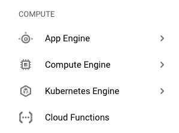
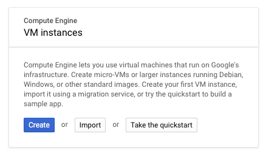
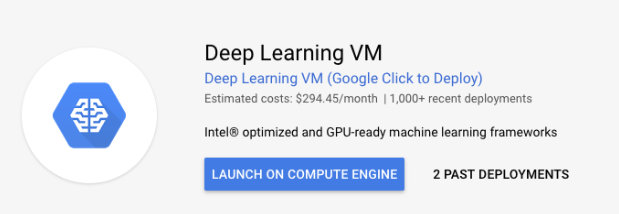
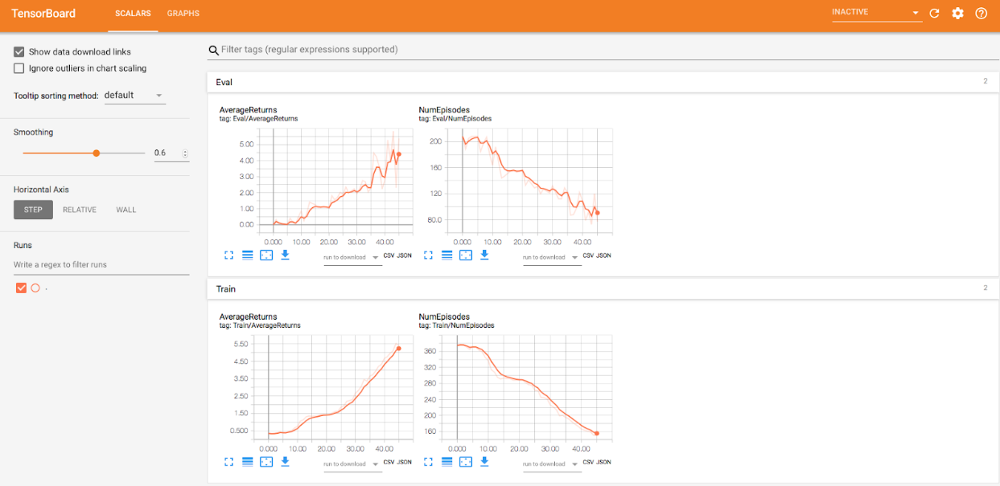

# Training an Obstacle Tower agent using Dopamine and the Google Cloud Platform

*Authors: Ervin Teng, Arthur Juliani*

This guide will walk you through the process of training an agent to navigate the Obstacle Tower environment. We will use the Google Dopamine library for training, and train using Google Cloud Platform. 

## Creating a New VM for Dopamine

First, create a Google Cloud Platform account by navigating here: [https://cloud.google.com/gcp](https://cloud.google.com/gcp). Once you go through setting up your account, you will be greeted by the Google Cloud Platform console. 

Find the Compute Engine page in the sidebar, as shown below, and click on it. This is the page for managing your VMs.  



The easiest way to get up and running is to use the Google Deep Learning VM Template (click-to-deploy) in the GCP Marketplace. This VM will take care of installing the deep learning library Tensorflow and its dependencies.

1. On the Compute Engine page, click “Create Instance.” If it’s your first time creating a VM, this popup will be in the center of your screen instead. Click “Create.”



2. On the sidebar, select “Marketplace”, and search for “Deep Learning VM” from Google Click-to-Deploy.



3. Click “Launch on Compute Engine.”

Configure the instance with at least 1 GPU, 2 cores, and 13GB of RAM (the default). For better performance, use 4 cores. 

**Developer’s Note:** Training speed will be determined by three things: how fast the environment can step through actions, how quickly the agent can process them, and how quickly the two can communicate. As the environment is fairly lightweight and runs at a fixed maximum speed, it is unlikely to be bottlenecked by the performance of the GPU that you select. Similarly, since a single environment does not generate samples tremendously fast, training is unlikely to consume an entire GPU. In most cases the communication between the environment and the learning agent will be the bottleneck For cost-effectiveness, you may select the Nvidia P4/T4, though you may get some small speed gains with the more expensive GPUs. 

Select “Intel Optimized Tensorflow v1.12” as the Framework.

Make sure to check "Install NVIDIA GPU driver automatically on first startup?" to install the proper drivers and CUDA, which are required to run Tensorflow and Obstacle Tower on the GPU

Once the instance boots up, be sure you can SSH into it. More info on how to do this can be found here: [https://cloud.google.com/compute/docs/instances/connecting-to-instance](https://cloud.google.com/compute/docs/instances/connecting-to-instance). 

### Set up XServer

To render the Obstacle Tower environment, you will need to install Xserver so that the GPU has something to render to when running Obstacle Tower. Follow the steps below, assuming you have a GPU configured for your VM.

Install Xorg and mesa-utils.

```bash
sudo apt update
sudo apt install -y xserver-xorg mesa-utils
```

Initialize `xorg.conf`.

```bash
sudo nvidia-xconfig -a --use-display-device=None --virtual=1280x1024
```

Run
 
```nvidia-xconfig --query-gpu-info ```

This will provide the PCI info for your particular VM and GPU. You will get an output that lists the info for your GPU. Find the line that reads PCI BusID (e.g. `PCI BusID : PCI:X:Y:Z`)

Add `BusID          "X:Y:Z"`

To `sudo nano /etc/X11/xorg.conf`, under Section “Device”. X, Y, and Z are the values returned by the `--query-gpu-info` command above. For instance, your section should look something like this:

```
Section "Device"
    Identifier     "Device0"
    Driver         "nvidia"
    VendorName     "NVIDIA Corporation"
    BoardName      "Tesla T4"
    BusID          "X:Y:Z"
EndSection
```

In order to start Xserver, you will need to run the two commands below. Note that you will need to run these again if you reboot the machine, and the export command again if you open a new bash terminal.

```bash
sudo /usr/bin/X :0 &
export DISPLAY=:0
```

Run `nvidia-smi`, and you should see that Xorg is running on your GPU. To make sure everything is running properly, run the command glxgears, and ensure it is running at framerates in the tens of thousands---this means that we are successfully rendering OpenGL graphics to the virtual screen using the GPU. 

### Install Obstacle Tower

We now need to install the the Obstacle Tower env package that creates a Gym interface for Obstacle Tower. 

Create and activate a Python virtualenv. This will keep your install separate from the system Python environment.

```bash
virtualenv otc-env --system-site-packages
source otc-env/bin/activate
```

#### Install the Obstacle Tower Environment

Installing the obstacle tower environment will allow Obstacle Tower to act as an OpenAI Gym environment, allowing you to use popular reinforcement learning libraries such as Dopamine or Baselines. Clone the repo, and use pip3 to install it and its dependencies. 

```bash
git clone https://github.com/Unity-Technologies/obstacle-tower-env
pip3 install ./ 
cd obstacle-tower-env
cd ../
```

#### Download Obstacle Tower Executables

This page lists the URLs for downloading Obstacle Tower for various platforms. [https://github.com/Unity-Technologies/obstacle-tower-env](https://github.com/Unity-Technologies/obstacle-tower-env). For GCP, run

```bash
wget https://storage.googleapis.com/obstacle-tower-build/v1.2/obstacletower_v1.2_linux.zip
unzip obstacletower_v1.2_linux.zip
```

### Install Dopamine
We will be performing training using Google Brain’s Dopamine library. This will allow us to use the state-of-the-art Rainbow algorithm to train the agent. This guide has been tested with Dopamine 2.0. (Commit `753a243`)

First, install Dopamine’s prerequisites. 

```bash
sudo apt update && sudo apt install cmake zlib1g-dev
pip3 install absl-py atari-py gin-config gym opencv-python
```

Then, clone the Dopamine repo itself. 

```bash
git clone https://github.com/google/dopamine.git
```

More information about the install process can be found at the Dopamine repo: [https://github.com/google/dopamine.git](https://github.com/google/dopamine.git).

#### Making Dopamine compatible with Obstacle Tower

You will then need to install the files that enable Dopamine to interact with the Obstacle Tower files. Download and extract the following files:

Download the files [here](https://storage.googleapis.com/obstacle-tower-build/dopamine/dopamine_otc.zip).

They can also be downloaded directly to the instance using:

```bash
wget https://storage.googleapis.com/obstacle-tower-build/dopamine/dopamine_otc.zip
unzip dopamine_otc.zip
```

Inside the ZIP, there will be two files: `unity_lib.py` and `rainbow_otc.gin`. One is a Dopamine library for the OTC environment, and the other is a configuration file.

* Place `unity_lib.py` in `dopamine/dopamine/discrete_domains`

```bash
cp dopamine_otc/unity_lib.py dopamine/dopamine/discrete_domains/unity_lib.py
```

* Place `rainbow_otc.gin` in a convenient location, e.g. 
`dopamine/dopamine/agents/rainbow/configs`. 

```bash
cp dopamine_otc/rainbow_otc.gin dopamine/dopamine/agents/rainbow/configs/rainbow_otc.gin
```

If you didn’t extract the `obstacletower_v1.2_linux.zip` to the home directory, you will need to edit `rainbow_otc.gin`, specifically `create_otc_environment.environment_path` should correspond to the path to your extracted OTC executable file. 

Furthermore, within this file you will find settings on how long to train for, and how often to evaluate your agent. Each iteration, Dopamine will train for `Runner.training_steps`, evaluate (i.e. run in inference mode) for `Runner.evaluation_steps`, record these results, and checkpoint the agent. It will repeat this process `Runner.num_iterations` number of times before quitting. For instance, you can change `Runner.num_iterations` to 40 to train for 10 million steps. You can also reduce `Runner.evaluation_steps` to reduce the time spent not training. There are other hyperparameters found in this file, which you can modify to improve performance. But for the sake of this exercise, you may leave them as-is. 

**Developer’s note:** These files are based off of the Dopamine library for Atari, i.e. `atari_lib.py`. We use the same network structure for Rainbow DQN as Atari. Since Dopamine only supports single-channel (i.e. grayscale) observations, we convert the observations given by the OTC environment to grayscale.   

## Training with Dopamine

### Running in the Background

You’re likely going to be running this training for a long time (possibly more than 24 hours!). This means running it in the background so you can disconnect from the VM in the meantime. One way to do this is to use screen. Open a new screen by typing:

```bash
screen -S dopamine_otc
```

This will open a new Bash shell. You will need to export the display and activate your virtual environment within this new shell.  

```bash
export DISPLAY=:0 
source otc-env/bin/activate
```

and run Dopamine here. Now, you can detach from the screen (`Ctrl + A, Ctrl +D`) and logout of your VM. The training will continue in the background. Reattach to the screen by typing `screen -r`. 

### Starting Dopamine

You are now ready to run Dopamine on Obstacle Tower! Run the following command from the root directory of the Dopamine repo. 

```bash
cd ./dopamine
python -um dopamine.discrete_domains.train \
  --base_dir=/tmp/dopamine \
  --gin_files='dopamine/agents/rainbow/configs/rainbow_otc.gin'
```

Where `base_dir` is the directory you want Dopamine to save its checkpoints (you can change this to something other than `/tmp/dopamine`) and tensorboard files, and `gin_files` is the path to `rainbow_otc.gin`.

### Monitoring Your Run

You can monitor your training run by using Tensorboard. To access Tensorboard, you will need to access a port on the GCP instance. You can do this by using port forwarding in SSH. For instance, if your instance’s IP is `X.X.X.X` and your username is `user`, you can forward port 6006 (the default Tensorboard port) to your local machine by SSHing into your instance with the following flags:

```bash
ssh -L 6006:127.0.0.1:6006 user@X.X.X.X
```

For instructions on other ways to access port 6006, see [here](https://cloud.google.com/solutions/connecting-securely). 

Once you are at the terminal, run 

```bash
tensorboard --logdir=/tmp/dopamine
```

Replace `/tmp/dopamine` with the `base_dir` you specified above. Now open a browser and go to `127.0.0.1:6006`. You should see a page that looks like this:



Here, you can monitor your reward over time. AverageReturns will increase as your agent learns to solve floors of the ObstacleTower---this example agent has been training for nearly three days. How high does your agent go? Can you do better? 


## Next Steps

Good job! You’ve now started training an agent to play Obstacle Tower. The algorithm and hyperparameters as they are won’t produce an agent which makes it all the way up the tower though. We encourage you to experiment with hyperparameters, as well as the algorithm and network architecture itself. For inspiration, you can read our paper on the Obstacle Tower [here](https://arxiv.org/abs/1902.01378). Good luck in the challenge.